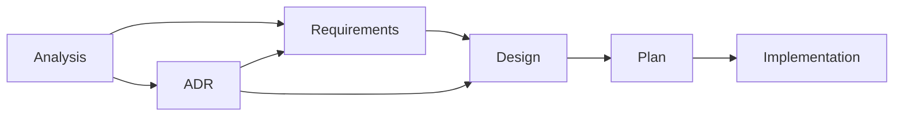

# AGENTS.md

## Documentation Language Policy

All documentation output in this project must be written in English, including:
- Code comments
- Commit messages
- Architecture Decision Records (ADRs)
- README files
- API documentation
- Error messages
- User-facing documentation
- Test descriptions
- TODO comments
- Any other written documentation

## Project Overview

Kopi is a JDK version management tool written in Rust that integrates with your shell to seamlessly switch between different Java Development Kit versions. It fetches JDK metadata from foojay.io and provides a simple, fast interface similar to tools like volta, nvm, and pyenv.

Key features:
- Automatic JDK version switching based on project configuration
- Multiple JDK vendor support (AdoptOpenJDK, Amazon Corretto, Azul Zulu, etc.)
- Shell integration via shims for transparent version management
- Project-specific JDK pinning via `.kopi-version` or `.java-version` files
- Fast performance using Rust

### User Documentation

The user-facing documentation for Kopi is maintained in a separate repository at `../kopi-vm.github.io/`. This repository uses MkDocs to generate and publish documentation for end users.

## Developer Principles

### Memory Safety Over Micro-optimization
- Prioritize memory safety and correctness over micro-optimizations
- Accept reasonable overhead (e.g., cloning small strings) to avoid memory leaks
- Follow Rust's ownership model strictly - avoid `unsafe` code and memory leaks from techniques like `Box::leak()`
- When faced with lifetime complexity, prefer simpler solutions that may use slightly more memory but are correct
- Example: Clone strings for HTTP headers instead of using `Box::leak()` to create static references

### Code Clarity
- Write clear, readable code that is easy to understand and maintain
- Use descriptive variable and function names
- Add comments for complex logic, but prefer self-documenting code
- Structure code to minimize cognitive load for future developers

### Clean Code Maintenance
- Remove unused variables, parameters, and struct members promptly
- When refactoring, trace through all callers to eliminate unnecessary parameters
- Keep structs lean by removing fields that are no longer used
- Use `cargo clippy` to identify unused code elements
- Example: If a function parameter like `arch` is no longer used in the implementation, remove it from the function signature and update all callers

### Prefer Functions Over Structs Without State
- When there's no state to manage, prefer implementing functionality as standalone functions rather than defining structs
- Only create structs when you need to maintain state, implement traits, or group related data
- This keeps the code simpler and more straightforward
- Example: For utility operations like file validation or string parsing, use functions directly instead of creating a struct with methods

### External API Testing
- When writing code that calls external Web APIs, implement at least one unit test that includes the actual JSON response obtained from calling the API with curl
- Store the JSON response as a string within the test code
- This ensures that the parsing logic is tested against real API responses
- Example:
```rust
#[test]
fn test_parse_foojay_api_response() {
    // JSON response obtained from: curl https://api.foojay.io/disco/v3.0/packages?version=21
    let json_response = r#"{
        "result": [
            {
                "id": "abcd1234",
                "distribution": "temurin",
                "major_version": 21,
                ...
            }
        ]
    }"#;
    
    let packages: Vec<Package> = serde_json::from_str(json_response).unwrap();
    assert_eq!(packages[0].distribution, "temurin");
}
```

### Avoid Generic "Manager" Naming
- When the name "manager" appears in file names, structs, traits, or similar constructs, consider more specific and descriptive alternatives
- "Manager" is often too abstract and doesn't clearly communicate the responsibility
- Choose names that describe what the component actually does
- Examples of better alternatives:
  - `FileManager` → `FileSystem`, `FileStore`, `FileRepository`
  - `ConnectionManager` → `ConnectionPool`, `ConnectionFactory`
  - `TaskManager` → `TaskScheduler`, `TaskExecutor`, `TaskQueue`
  - `ShimManager` → `ShimInstaller`, `ShimRegistry`, `ShimProvisioner`
- This principle helps maintain code clarity and makes the codebase more intuitive

### Avoid Vague "Util" or "Utils" Naming
- Never use "util" or "utils" in directory names, file names, class names, or variable names
- These terms are too generic and don't clearly convey the purpose or responsibility
- Always choose specific names that describe the actual functionality
- Examples of better alternatives:
  - `utils/strings.rs` → `string_operations.rs`, `text_processing.rs`, `string_formatter.rs`
  - `FileUtils` → `FileOperations`, `FileSystem`, `PathValidator`
  - `DateUtil` → `DateFormatter`, `DateParser`, `TimeCalculator`
  - `CommonUtils` → Split into specific modules based on functionality
  - `util_function()` → Name based on what it does: `validate_input()`, `format_output()`
- This principle ensures code is self-documenting and responsibilities are clear

## Traceable Development Lifecycle (TDL)

*Structured phases, linked artifacts, verifiable outcomes*

This project follows the Traceable Development Lifecycle (TDL), a structured development process with full traceability from requirements to implementation. The complete TDL documentation and supporting templates are maintained in:

**[`docs/tdl.md`](docs/tdl.md)** - Full TDL documentation and workflow  
**[`docs/templates/README.md`](docs/templates/README.md)** - Template descriptions and usage instructions

## Quick Reference

### TDL Process Overview


### Key Locations
- **Templates**: `docs/templates/` - All document templates
- **Analysis**: `docs/analysis/AN-<id>-<topic>.md` - Problem exploration
- **Requirements**: `docs/requirements/FR-<id>-<capability>.md` and `NFR-<id>-<quality>.md` - Formal requirements
- **ADRs**: `docs/adr/ADR-<id>-<title>.md` - Architecture decisions (new format)
- **ADRs (Archive)**: `docs/adr/archive/###-<title>.md` - Historical ADRs (pre-2025)
- **Tasks**: `docs/tasks/T-<id>-<task>/` - Design and plan documents (new format)
- **Tasks (Archive)**: `docs/tasks/archive/<task>/` - Historical tasks (pre-2025)
- **Traceability**: `docs/traceability.md` - Central mapping matrix

### Essential Guidelines
- All documentation must be in English (per `CLAUDE.md`)
- For repository conventions (commands, architecture, error handling), see `CLAUDE.md`
- Follow the Traceable Development Lifecycle (TDL) for all non-trivial changes
- Maintain traceability through requirement IDs (FR-<id>/NFR-<id>) and ADR references
- Small changes can use simplified workflow (see templates README)

For detailed TDL phases, pull request checklists, and archive policies, refer to [`docs/tdl.md`](docs/tdl.md).  
For template usage instructions, refer to [`docs/templates/README.md`](docs/templates/README.md).

## Development Workflow

### Completing Work

#### Rust Code
When finishing any Rust coding task, always run the following commands in order and fix any issues:

1. `cargo fmt` - Auto-format code
2. `cargo clippy --all-targets -- -D warnings` - Check for linting errors in test code
3. `cargo test --lib --quiet` - Run unit tests (faster than full test suite)

Address any errors from each command before proceeding to the next. All must pass successfully before considering the work complete.

#### Markdown Documentation
When working on Markdown documentation (`.md` files), run the following commands:

1. `bun format` - Auto-format markdown files
   - Automatically fixes formatting issues
   - Ensures consistent markdown style across all documentation

2. `bun lint` - Check markdown linting
   - Identifies potential issues and violations
   - Common issues: trailing spaces, inconsistent indentation, missing blank lines
   - Fix any warnings or errors reported

Both commands must pass successfully before considering the documentation work complete.

#### TypeScript Code
When editing any TypeScript files, run each of the following commands and resolve any reported errors before moving on:

1. `bun format:ts` - Format TypeScript sources
2. `bun lint:ts` - Lint TypeScript code with project rules
3. `AGENT=1 bun test:ts` - Execute the TypeScript test suite

All three commands must complete without errors to finish TypeScript-related work.

## Essential Commands

- **Format**: `cargo fmt` - Format code using rustfmt
- **Lint**: `cargo clippy --all-targets -- -D warnings` - Run linter with strict warnings
- **Build**: `cargo build` (debug), `cargo build --release` (production)
- **Test**: `cargo test --lib --quiet` - Run unit tests efficiently

## Additional Documentation

- **Architecture & Structure**: [`docs/architecture.md`](docs/architecture.md) - Project structure, components, and storage locations
- **Error Handling**: [`docs/error_handling.md`](docs/error_handling.md) - Error types, exit codes, and context system
