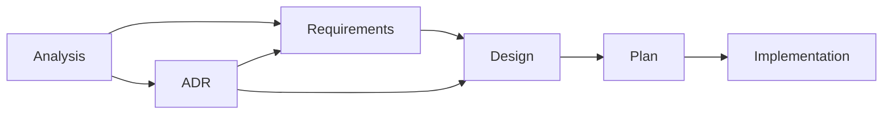

# AGENTS.md

## Template-Driven Workflow

This project follows a structured development process using templates for all documentation. The complete workflow documentation and templates are maintained in:

📚 **[`docs/templates/README.md`](docs/templates/README.md)** - Full workflow documentation, template descriptions, and usage instructions

## Quick Reference

### Workflow Overview

### Key Locations
- **Templates**: `docs/templates/` - All document templates
- **Analysis**: `docs/analysis/<topic>.md` - Problem exploration
- **Requirements**: `docs/requirements/FR-####.md` and `NFR-####.md` - Formal requirements
- **ADRs**: `docs/adr/###-<title>.md` - Architecture decisions  
- **Tasks**: `docs/tasks/<task>/` - Design and plan documents
- **Traceability**: `docs/traceability.md` - Central mapping matrix

### Essential Guidelines
- All documentation must be in English (per `CLAUDE.md`)
- For repository conventions (commands, architecture, error handling), see `CLAUDE.md`
- Follow the template-driven workflow for all non-trivial changes
- Maintain traceability through requirement IDs (FR-####/NFR-####) and ADR references
- Small changes can use simplified workflow (see templates README)

For detailed workflow steps, template usage instructions, pull request checklists, and archive policies, refer to the comprehensive documentation in [`docs/templates/README.md`](docs/templates/README.md).