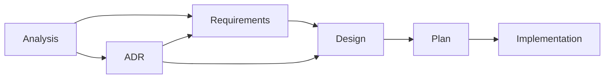

# AGENTS.md

## Traceable Development Lifecycle (TDL)

*Structured phases, linked artifacts, verifiable outcomes*

This project follows the Traceable Development Lifecycle (TDL), a structured development process with full traceability from requirements to implementation. The complete TDL documentation and supporting templates are maintained in:

📚 **[`docs/templates/README.md`](docs/templates/README.md)** - Full TDL documentation, template descriptions, and usage instructions

## Quick Reference

### TDL Process Overview

### Key Locations
- **Templates**: `docs/templates/` - All document templates
- **Analysis**: `docs/analysis/AN-####-<topic>.md` - Problem exploration
- **Requirements**: `docs/requirements/FR-####-<capability>.md` and `NFR-####-<quality>.md` - Formal requirements
- **ADRs**: `docs/adr/ADR-####-<title>.md` - Architecture decisions (new format)
- **ADRs (Archive)**: `docs/adr/archive/###-<title>.md` - Historical ADRs (pre-2025)
- **Tasks**: `docs/tasks/T-####-<task>/` - Design and plan documents (new format)
- **Tasks (Archive)**: `docs/tasks/archive/<task>/` - Historical tasks (pre-2025)
- **Traceability**: `docs/traceability.md` - Central mapping matrix

### Essential Guidelines
- All documentation must be in English (per `CLAUDE.md`)
- For repository conventions (commands, architecture, error handling), see `CLAUDE.md`
- Follow the Traceable Development Lifecycle (TDL) for all non-trivial changes
- Maintain traceability through requirement IDs (FR-####/NFR-####) and ADR references
- Small changes can use simplified workflow (see templates README)

For detailed TDL phases, template usage instructions, pull request checklists, and archive policies, refer to the comprehensive documentation in [`docs/templates/README.md`](docs/templates/README.md).