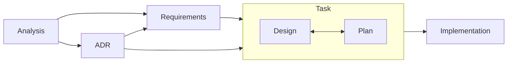

# AGENTS.md

## Documentation Language Policy

All documentation output in this project must be written in English, including:

- Code comments
- Commit messages
- Architecture Decision Records (ADRs)
- README files
- API documentation
- Error messages
- User-facing documentation
- Test descriptions
- TODO comments
- Any other written documentation

## Project Overview

Kopi is a JDK version management tool written in Rust that integrates with your shell to seamlessly switch between different Java Development Kit versions. It fetches JDK metadata from foojay.io and provides a simple, fast interface similar to tools like volta, nvm, and pyenv.

Key features:

- Automatic JDK version switching based on project configuration
- Multiple JDK vendor support (AdoptOpenJDK, Amazon Corretto, Azul Zulu, etc.)
- Shell integration via shims for transparent version management
- Project-specific JDK pinning via `.kopi-version` or `.java-version` files
- Fast performance using Rust

### User Documentation

The user-facing documentation for Kopi is maintained in a separate repository at `../kopi-vm.github.io/`. This repository uses MkDocs to generate and publish documentation for end users.

## Agent Operating Environment

### Planning and Tooling Discipline

- Use the planning tool for any task that is not trivially simple; plans must include at least two steps and be updated as work progresses. Skip planning only for the simplest \~25% of tasks.
- At the start of each session, run `serena__activate_project` to bind Serena to the current repository context.
- After activation, run `serena__check_onboarding_performed`; if it indicates onboarding is incomplete, execute `serena__onboarding` before proceeding.
- At the start of each task, run `bun scripts/trace-status.ts --write` to regenerate `docs/traceability.md` and identify any traceability gaps before continuing.
- Before insert/replace/delete edits, invoke `serena__think_about_task_adherence`; after gathering significant context, call `serena__think_about_collected_information` to confirm understanding.
- Follow the Traceable Development Lifecycle (TDL) for non-trivial work and ensure traceability artifacts stay in sync.

### Approvals and Safety

- Exercise caution with destructive operations (`rm`, `git reset`, etc.); seek explicit user direction before proceeding.
- If unexpected repository changes appear, pause and confirm next steps with the user.

## Developer Principles

### Memory Safety Over Micro-optimization

- Prioritize memory safety and correctness over micro-optimizations
- Accept reasonable overhead (e.g., cloning small strings) to avoid memory leaks
- Follow Rust's ownership model strictly - avoid `unsafe` code and memory leaks from techniques like `Box::leak()`
- When faced with lifetime complexity, prefer simpler solutions that may use slightly more memory but are correct
- Example: Clone strings for HTTP headers instead of using `Box::leak()` to create static references

### Code Clarity

- Write clear, readable code that is easy to understand and maintain
- Use descriptive variable and function names
- Add comments for complex logic, but prefer self-documenting code
- Structure code to minimize cognitive load for future developers

### Clean Code Maintenance

- Remove unused variables, parameters, and struct members promptly
- When refactoring, trace through all callers to eliminate unnecessary parameters
- Keep structs lean by removing fields that are no longer used
- Use `cargo clippy` to identify unused code elements
- Example: If a function parameter like `arch` is no longer used in the implementation, remove it from the function signature and update all callers

### Prefer Functions Over Structs Without State

- When there's no state to manage, prefer implementing functionality as standalone functions rather than defining structs
- Only create structs when you need to maintain state, implement traits, or group related data
- This keeps the code simpler and more straightforward
- Example: For utility operations like file validation or string parsing, use functions directly instead of creating a struct with methods

### External API Testing

- When writing code that calls external Web APIs, implement at least one unit test that includes the actual JSON response obtained from calling the API with curl
- Store the JSON response as a string within the test code
- This ensures that the parsing logic is tested against real API responses
- Example:

```rust
#[test]
fn test_parse_foojay_api_response() {
    // JSON response obtained from: curl https://api.foojay.io/disco/v3.0/packages?version=21
    let json_response = r#"{
        "result": [
            {
                "id": "abcd1234",
                "distribution": "temurin",
                "major_version": 21,
                ...
            }
        ]
    }"#;

    let packages: Vec<Package> = serde_json::from_str(json_response).unwrap();
    assert_eq!(packages[0].distribution, "temurin");
}
```

### Avoid Generic "Manager" Naming

- When the name "manager" appears in file names, structs, traits, or similar constructs, consider more specific and descriptive alternatives
- "Manager" is often too abstract and doesn't clearly communicate the responsibility
- Choose names that describe what the component actually does
- Examples of better alternatives:
  - `FileManager` → `FileSystem`, `FileStore`, `FileRepository`
  - `ConnectionManager` → `ConnectionPool`, `ConnectionFactory`
  - `TaskManager` → `TaskScheduler`, `TaskExecutor`, `TaskQueue`
  - `ShimManager` → `ShimInstaller`, `ShimRegistry`, `ShimProvisioner`
- This principle helps maintain code clarity and makes the codebase more intuitive

### Avoid Vague "Util" or "Utils" Naming

- Never use "util" or "utils" in directory names, file names, class names, or variable names
- These terms are too generic and don't clearly convey the purpose or responsibility
- Always choose specific names that describe the actual functionality
- Examples of better alternatives:
  - `utils/strings.rs` → `string_operations.rs`, `text_processing.rs`, `string_formatter.rs`
  - `FileUtils` → `FileOperations`, `FileSystem`, `PathValidator`
  - `DateUtil` → `DateFormatter`, `DateParser`, `TimeCalculator`
  - `CommonUtils` → Split into specific modules based on functionality
  - `util_function()` → Name based on what it does: `validate_input()`, `format_output()`
- This principle ensures code is self-documenting and responsibilities are clear

### Module Placement Consistency

- Consult `docs/architecture.md` before creating or moving modules so directory structure stays aligned with the documented layout.
- Keep platform-dependent code under `src/platform/` (and its submodules) and expose only cross-platform interfaces from higher layers.
- When introducing new components, document their location rationale in the relevant design or plan to aid future maintainers.

### Prevent Circular Module Dependencies

- Keep the module graph acyclic so features remain testable and maintainable.
- Favor dependency inversion (traits, interfaces) or data transfer structures instead of bidirectional imports when modules must collaborate.
- If a new dependency would close a cycle, refactor by extracting shared functionality into a dedicated module documented in the architecture references.
- Run dependency analysis tools or targeted `cargo check` commands when restructuring to confirm cycles are not introduced.

## Traceable Development Lifecycle (TDL)

_Structured phases, linked artifacts, verifiable outcomes_

This project follows the Traceable Development Lifecycle (TDL), a structured development process with full traceability from discovery through delivery. Consult the primary references when in doubt:

**[`docs/tdl.md`](docs/tdl.md)** - Full TDL documentation and workflow\
**[`docs/templates/README.md`](docs/templates/README.md)** - Template descriptions and usage instructions

### TDL Process Overview



### Key Locations

- **Templates**: `docs/templates/` - All document templates
- **Analysis**: `docs/analysis/AN-<id>-<topic>.md` - Problem exploration
- **Requirements**: `docs/requirements/FR-<id>-<capability>.md` and `NFR-<id>-<quality>.md` - Formal requirements
- **ADRs**: `docs/adr/ADR-<id>-<title>.md` - Architecture decisions (current format)
- **Tasks**: `docs/tasks/T-<id>-<task>/` - Design and plan documents (current format)
- **Traceability**: `docs/traceability.md` - Central mapping matrix

### Document Creation Order and Staged Approvals

Produce TDL artifacts sequentially and pause after every stage until the user gives explicit approval (e.g., “Approved”, “承認します”, “proceed to next stage”). Never advance on the assumption that silence or indirect phrasing grants permission.

1. **Analysis (`docs/analysis/AN-…`)** – Capture the problem space, alternatives, and context. Present the analysis for review and **wait for explicit approval** before moving on to requirements.
2. **Requirements (`docs/requirements/FR-…` / `NFR-…`)** – Translate the approved analysis into verifiable functional and non-functional requirements. After drafting, present them and **wait for explicit approval** before authoring an ADR.
3. **Architecture Decision (`docs/adr/ADR-…`)** – Record structural decisions needed to satisfy the requirements. Submit the ADR for review and **wait for explicit approval** before creating the task package.
4. **Task (`docs/tasks/T-…/`)** – With approved upstream documents in place, create the task directory and write `design.md` and `plan.md`, then update the task’s `README.md` before requesting a review. Share the task artifacts and **wait for explicit approval** before beginning implementation.
5. **Implementation** – Start code changes only after confirming that every prior stage has explicit approval and the relevant task ID is referenced in the work. Track progress using the plan template’s Status Tracking categories: Not Started (work has not begun), Phase X In Progress (actively executing a specific phase), Phase X Completed (phase finished and moving to the next), Blocked (waiting on an external dependency), Under Review (implementation complete and awaiting review), and Completed (all phases done and verified). Update the status as you transition between phases and, before requesting a review, move the active phase to Under Review and change every completed checklist item from `[ ]` to `[x]` so reviewers see the current state.

**Approval Rules**

- Do not create multiple document stages in a single session without collecting approvals between them.
- When instructions are ambiguous or indirect (e.g., “Start work”, “Option A please”), verify intent with the user instead of assuming approval.
- Maintain a record of which artifacts have been approved so the audit trail stays intact.

**Violation Recovery**

1. Stop immediately if multiple stages were completed without approvals.
2. Inform the user about the lapse and ask whether to delete premature documents and restart, or to treat the artifacts as drafts for sequential review.

Always confirm that the upstream artifacts exist and have explicit approvals before drafting downstream documents. If a task exposes a missing analysis, requirement, or ADR, pause implementation work, create the required artifact using the templates, obtain approval, and then resume the task.

## Development Workflow

### Completing Work

#### Rust Code

When finishing any Rust coding task, always run the following commands in order and fix any issues:

1. `cargo fmt` - Auto-format code
2. `cargo clippy --all-targets -- -D warnings` - Check for linting errors in test code
3. `cargo test --lib --quiet` - Run unit tests (faster than full test suite)

Address any errors from each command before proceeding to the next. All must pass successfully before considering the work complete.

#### Markdown Documentation

When working on Markdown documentation (`.md` files), run the following commands:

1. `bun format` - Auto-format markdown files
   - Automatically fixes formatting issues
   - Ensures consistent markdown style across all documentation

2. `bun lint` - Check markdown linting
   - Identifies potential issues and violations
   - Common issues: trailing spaces, inconsistent indentation, missing blank lines
   - Fix any warnings or errors reported

Both commands must pass successfully before considering the documentation work complete. After the document is finalized, compare it against the source template (for example, `docs/templates/analysis.md`) to confirm the Metadata, Links, and status selections remain consistent with the current standards.

#### TypeScript Code

When editing any TypeScript files, run each of the following commands and resolve any reported errors before moving on:

1. `bun format:ts` - Format TypeScript sources
2. `bun lint:ts` - Lint TypeScript code with project rules
3. `AGENT=1 bun test:ts` - Execute the TypeScript test suite

All three commands must complete without errors to finish TypeScript-related work.

### Documentation Updates

- Ensure documentation, comments, and messages remain in English.
- For Markdown changes, run `bun format` followed by `bun lint` and resolve any reported issues before finalizing.
- If `docs/traceability.md` is missing or you add or remove any files under `docs/`, run `bun scripts/trace-status.ts --write` to regenerate the traceability matrix before completing the work.
- During implementation, mark the completed phase checkboxes in the relevant documents at the end of each phase so progress stays transparent and auditable.

## Essential Commands

- **Format**: `cargo fmt` - Format code using rustfmt
- **Lint**: `cargo clippy --all-targets -- -D warnings` - Run linter with strict warnings
- **Build**: `cargo build` (debug), `cargo build --release` (production)
- **Test**: `cargo test --lib --quiet` - Run unit tests efficiently

## Additional Documentation

- **Architecture & Structure**: [`docs/architecture.md`](docs/architecture.md) - Project structure, components, and storage locations
- **Error Handling**: [`docs/error_handling.md`](docs/error_handling.md) - Error types, exit codes, and context system

## Communication Guidelines

- Default to concise, friendly teammate tone; structure responses for quick scanning without over-formatting.
- Lead code-change summaries with the key outcome, then reference affected paths with `path:line` format (no ranges).
- Use bullets (`-`) for lists, avoid nested bullets, and reserve headings for major sections only when helpful.
- Include suggested next steps (tests, commits, verification) when they naturally follow from the work performed.
- Do not paste entire file contents; reference file paths instead.
- When the user requests command output, summarize relevant lines rather than dumping full logs.
- Execute simple user requests via shell commands when appropriate (e.g., `date`), respecting the environment rules above.
