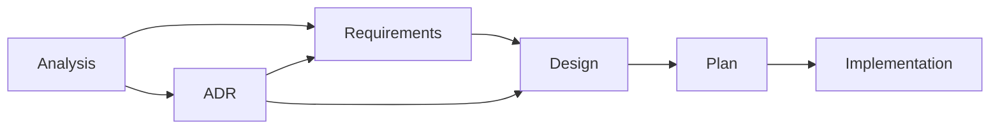

# Traceable Development Lifecycle (TDL)

_Structured phases, linked artifacts, verifiable outcomes_

This document describes the Traceable Development Lifecycle (TDL), a template-based development process that ensures full traceability from requirements to implementation.

## Overview

The TDL progresses through distinct phases, each with specific deliverables:



**Key paths:**

- Analysis discovers both requirements and architectural concerns
- ADRs can generate new requirements (constraints/standards)
- Both requirements and ADRs feed into design decisions
- Design integrates all inputs before proceeding to plan

## Document Organization

<table>
<thead>
<tr>
<th>Phase</th>
<th>Document Type</th>
<th>Template</th>
<th>Created Files Location</th>
<th>Naming Convention</th>
<th>Lifecycle</th>
</tr>
</thead>
<tbody>
<tr>
<td><strong>Discovery</strong></td>
<td>Analysis</td>
<td><code>analysis.md</code></td>
<td><code>docs/analysis/AN-&lt;id&gt;-&lt;topic&gt;.md</code></td>
<td><code>AN-&lt;5char-id&gt;-&lt;topic&gt;</code> (e.g., <code>AN-a3bf2-cache-optimization.md</code>)</td>
<td>Temporary, archived after requirements formalized</td>
</tr>
<tr>
<td rowspan="2"><strong>Requirements</strong></td>
<td>Functional Req</td>
<td><code>requirements.md</code></td>
<td><code>docs/requirements/FR-&lt;id&gt;-&lt;capability&gt;.md</code></td>
<td><code>FR-&lt;5char-id&gt;-&lt;capability&gt;</code> (e.g., <code>FR-b4cd8-user-authentication.md</code>)</td>
<td>Long-lived, evolve independently</td>
</tr>
<tr>
<td>Non-Functional Req</td>
<td><code>requirements.md</code></td>
<td><code>docs/requirements/NFR-&lt;id&gt;-&lt;quality&gt;.md</code></td>
<td><code>NFR-&lt;5char-id&gt;-&lt;quality&gt;</code> (e.g., <code>NFR-c5de9-performance.md</code>)</td>
<td>Long-lived, evolve independently</td>
</tr>
<tr>
<td><strong>Decisions</strong></td>
<td>ADRs</td>
<td><code>adr.md</code><br><code>adr-lite.md</code></td>
<td><code>docs/adr/ADR-&lt;id&gt;-&lt;title&gt;.md</code></td>
<td><code>ADR-&lt;5char-id&gt;-&lt;title&gt;</code> (e.g., <code>ADR-d6ef0-cache-storage-format.md</code>)</td>
<td>Long-lived, document decisions</td>
</tr>
<tr>
<td rowspan="3"><strong>Tasks</strong></td>
<td>Task Directory</td>
<td>N/A</td>
<td><code>docs/tasks/T-&lt;id&gt;-&lt;name&gt;/</code></td>
<td><code>T-&lt;5char-id&gt;-&lt;name&gt;</code> (e.g., <code>T-e7fa1-cache-refresh/</code>)</td>
<td>Task-scoped container</td>
</tr>
<tr>
<td>Task Design</td>
<td><code>design.md</code></td>
<td><code>docs/tasks/T-&lt;id&gt;-&lt;name&gt;/design.md</code></td>
<td>Fixed name <code>design.md</code> within task directory</td>
<td>Task-scoped</td>
</tr>
<tr>
<td>Task Plan</td>
<td><code>plan.md</code></td>
<td><code>docs/tasks/T-&lt;id&gt;-&lt;name&gt;/plan.md</code></td>
<td>Fixed name <code>plan.md</code> within task directory</td>
<td>Task-scoped</td>
</tr>
<tr>
<td><strong>Tracking</strong></td>
<td>Traceability</td>
<td>N/A (not a template)</td>
<td><code>docs/traceability.md</code></td>
<td>Single file (project document)</td>
<td>Long-lived, central N:M mapping</td>
</tr>
</tbody>
</table>

## Parallel Development Support

This project supports parallel development using git-worktree with unique IDs to prevent conflicts.

**→ See [`parallel-development.md`](parallel-development.md) for details on:**

- 5-character random ID generation
- Avoiding merge conflicts
- On-demand traceability viewing
- Migration from sequential IDs

## Development Workflow Steps

### Step 1: Analysis (exploration/discovery)

- **Purpose**: Explore problem space, gather data, understand stakeholder needs
  - Be exploratory - it's OK to have uncertainties
  - Document what you learn as you learn it
  - Focus on understanding the problem before jumping to solutions
  - Keep it lightweight - this is a working document
  - Transition discovered requirements to formal FR/NFR documents when ready
- **Template**: [`templates/analysis.md`](templates/analysis.md) - Template for exploratory analysis and problem space investigation. Used to discover requirements through research and stakeholder analysis
- **Output**: List of discovered requirements (FR-DRAFT, NFR-DRAFT) and architectural concerns
- **Location**: `docs/analysis/AN-<id>-<topic>.md` (move to `archive/` when complete)
- **Naming**: `AN-<id>-<topic>` format (e.g., `AN-a3bf2-cache-optimization.md`)
- **ID Generation**: Run `./scripts/tdl-new-id.py` (see [`parallel-development.md`](parallel-development.md))
- **Transition**: Analysis can lead to:
  - Creating formal requirements from discoveries
  - Identifying architectural decisions that need to be made
- **Traceability Update**: Add new analysis document to `docs/traceability.md` immediately upon creation

### Step 2: Requirements (what/why)

- **Purpose**: Formalize individual requirements with clear acceptance criteria
- **Template**: [`templates/requirements.md`](templates/requirements.md) - Template for individual requirement documents (FR-<id>-<capability> or NFR-<id>-<quality>). Each requirement is a standalone, long-lived document
- **Output**: Formal requirements with IDs (`FR-<id>-<capability>`, `NFR-<id>-<quality>`), measurable criteria
- **Location**: `docs/requirements/FR-<id>-<capability>.md` and `docs/requirements/NFR-<id>-<quality>.md`
- **Naming**: `FR-<id>-<capability>` and `NFR-<id>-<quality>` format
- **ID Generation**: Run `./scripts/tdl-new-id.py` (see [`parallel-development.md`](parallel-development.md))
- **Sources**: Can come from:
  - Analysis documents (discovered requirements)
  - ADR decisions (derived requirements/constraints)
- **Transition**: Requirements feed into design
- **Relationships**: One analysis can discover multiple requirements; requirements can span multiple tasks (N:M)
- **Traceability Update**: Add each new requirement to "Requirements → Tasks → Tests Matrix" with source analysis/ADR

### Step 3: Architecture Decisions (decisions/trade-offs)

- **Purpose**: Make and document significant architecture/design decisions
  - Verify against existing implementation before documenting decisions
  - Check actual code for directory structures, constants, and naming conventions
  - Don't assume patterns from other tools apply - each project has its own conventions
  - Reference specific code locations when describing current state
  - Document both the decision and its rationale with concrete examples
- **Templates**:
  - [`templates/adr.md`](templates/adr.md) - Full ADR template for architecturally significant decisions, broad impact, or important trade-offs
  - [`templates/adr-lite.md`](templates/adr-lite.md) - Lightweight ADR for tactical choices with limited scope and clear best practices
- **Output**: ADR documents with decisions, rationale, and consequences
- **Location**: `docs/adr/ADR-<id>-<title>.md` (new) or `docs/adr/archive/###-<title>.md` (existing)
- **Naming**: `ADR-<id>-<descriptive-title>.md` (e.g., `ADR-d6ef0-cache-storage-format.md`)
- **ID Generation**: Run `./scripts/tdl-new-id.py` (see [`parallel-development.md`](parallel-development.md))
- **Sources**: Triggered by analysis findings or implementation needs
- **Transition**: ADRs can:
  - Generate new requirements (constraints/standards)
  - Feed directly into design for architectural constraints
- **Traceability Update**: Update ADRs column for affected requirements; add any new derived requirements

### Step 4: Design (how to implement)

- **Purpose**: Technical design for implementing requirements within architecture constraints
- **Template**: [`templates/design.md`](templates/design.md) - Task-specific design document. References requirement IDs and documents how to implement them
- **Output**: Component design, data flows, APIs, error handling strategy
- **Sources**: Integrates inputs from:
  - Requirements (what needs to be built)
  - ADRs (architectural constraints and decisions)
- **References**: FR/NFR IDs and relevant ADRs (don't duplicate requirement text)
- **Location**: `docs/tasks/T-<id>-<task>/design.md` (task-scoped)
- **Naming**: Task directory + fixed name (e.g., `docs/tasks/T-e7fa1-cache-refresh/design.md`)
- **ID Generation**: Run `./scripts/tdl-new-id.py` for the task directory (see [`parallel-development.md`](parallel-development.md))
- **Transition**: With design complete, create execution plan
- **Traceability Update**: Add task to "Task Status" table; link task to requirements in matrix

### Step 5: Plan & Execution (phases/tasks)

- **Purpose**: Break down implementation into manageable phases with clear verification
- **Template**: [`templates/plan.md`](templates/plan.md) - Task-specific implementation plan. Breaks down work into phases with verification steps
- **Output**: Phased execution plan with tasks, verification steps, and DoD
- **References**: FR/NFR IDs being implemented, link to design.md
- **Verification**: Use commands from `CLAUDE.md`:
  - `cargo check`, `cargo fmt`, `cargo clippy --all-targets -- -D warnings`
  - `cargo test --lib --quiet`, `cargo it`, `cargo perf`, `cargo bench`
- **Location**: `docs/tasks/T-<id>-<task>/plan.md` (task-scoped)
- **Naming**: Task directory + fixed name (e.g., `docs/tasks/T-e7fa1-cache-refresh/plan.md`)
- **Transition**: Execute the plan, updating status and traceability matrix
- **Phase Independence**: Each phase must be self-contained and executable independently:
  - Context may be reset between phases (`/clear` command)
  - Critical information must be documented in phase deliverables
  - Dependencies between phases must be explicitly stated
- **Traceability Update**: Update requirement status (Proposed → In Progress → Implemented → Verified) as work progresses

## Common Documentation Requirements

These requirements apply to ALL documentation templates (Requirements, Design, Plan, and ADRs):

### Document Structure

- **Metadata**: Include Type/Owner/Reviewers/Status/Date Created consistently at the top of every document
- **Document IDs**: Must be in the filename and Metadata section (not in document titles)
- **Links Section**: Mandatory in every template for traceability. If something doesn't apply, write: `N/A – <reason>`
- **Change History**: Use Git history (`git log --follow <file>`). Templates intentionally omit Change Log sections to avoid duplication

### Writing Standards

- **Language**: All documentation must be written in English (per `CLAUDE.md` policy)
- **Date Format**: Use `YYYY-MM-DD` format consistently
- **IDs & Naming**: Use explicit, stable IDs/names. Avoid vague terms like "manager" or "util" (per `CLAUDE.md`)
- **Consistency**: Don't duplicate requirements text; Design references requirement IDs; Plan references both

### Linking & Cross-References

- **Cross-linking**: Use relative links between documents
- **Links vs External References**: Maintain clear distinction:
  - **Links**: Internal project artifacts only (files in repo, issues, PRs) for traceability
  - **External References**: External resources only (standards, articles, documentation)
  - **Simple rule**: "Repository or internal tracker? → Links. Everything else? → External References"
- **ID Usage**: Use FR/NFR/ADR IDs throughout documentation
- **Document Flow**: Cross-link Requirements → Design → Plan documents
- **Requirements Mapping**: Include Requirements Mapping table in Design documents
- **Test References**: Reference IDs in tests where feasible

### Process Requirements

- **Verification**: Use canonical cargo commands from `CLAUDE.md` in Verification blocks and Definition of Done
- **PR Integration**: Link Requirements/Design/Plan and relevant ADRs in PRs; verify DoD items from `AGENTS.md`

## Traceability System

### Traceability Principles

- **Source of Truth**: Each document's Links section maintains its relationships
- **Analysis → Requirements**: Track in analysis document's Links section
- **Requirements → Tasks**: Track in task document's Links section
- **In-Doc Links**: All documents must maintain Links sections for traceability
- **Tests**: Reference `FR-<id>`/`NFR-<id>` in test names or comments when feasible
- **Review Order**: Analysis (exploration) → Requirements (scope) → ADR (decisions) → Design (architecture) → Plan (execution)

### Status Viewing Tools

Traceability is maintained through Links sections in each document and viewed on-demand:

```bash
python3 scripts/trace-status.py        # Full status
python3 scripts/trace-status.py --gaps # Only gaps
python3 scripts/trace-status.py --check # CI mode
```

**→ See [`parallel-development.md`](parallel-development.md) for implementation details**

### When to Update Links

Update the Links section in documents when:

1. **Analysis Phase**
   - ✅ New analysis document created → Add Links section
   - ✅ Requirements discovered → List them in "Formal Requirements" subsection

2. **Requirements Phase**
   - ✅ New requirement created → Add Links to source analysis/ADR
   - ✅ Requirement affects ADRs → Update Links section

3. **Architecture Decision Phase**
   - ✅ ADR created → Add Links to related requirements
   - ✅ ADR supersedes another → Update both ADRs' Links sections

4. **Task Creation Phase**
   - ✅ New task created → Add Links to requirements being implemented
   - ✅ Task references ADRs → Include in Links section

5. **Implementation Phase**
   - ✅ Status changes → Update Status field in document metadata
   - ✅ New relationships discovered → Update Links sections

6. **Verification**
   - ✅ Run `python3 scripts/trace-status.py` to check for gaps
   - ✅ Fix any orphan requirements or tasks before PR

## Pull Request Checklist

- Link relevant artifacts in the PR description:
  - Source analysis documents if applicable
  - `FR-<id>`/`NFR-<id>` requirements being addressed
  - Affected task folder(s) under `docs/tasks/T-<id>-<task>`
  - Related ADRs
- Automated Verification Checklist:
  - [ ] Format verified: `cargo fmt --check`
  - [ ] Linting clean: `cargo clippy --all-targets -- -D warnings`
  - [ ] All test commands pass: `cargo test --lib --quiet`
  - [ ] Requirements traced: All FR/NFR IDs referenced in code comments where applicable
  - [ ] ADR references: Design decisions linked to ADR numbers
- Manual Verification:
  - [ ] Error messages clear and in English (per `CLAUDE.md`)
  - [ ] Documentation updated (`docs/reference.md`, user docs if needed)
  - [ ] Platform behavior validated when relevant
  - [ ] **Traceability verified**: Run `python3 scripts/trace-status.py --check`
  - [ ] **Links sections updated**: All document relationships current
  - [ ] **No orphan documents**: All requirements have tasks (or are marked as future work)

## Small Changes Variant

- For trivial fixes, you may skip the full workflow if **ALL** these criteria apply:
  - Code changes < 50 lines
  - No new dependencies
  - No API changes
  - No architectural impact
  - Single file modification
  - Estimated execution time < 30 minutes
- Create minimal `docs/tasks/T-<id>-<task>/plan.md` with a short Phase and DoD
- Ensure all verification commands pass
- **Traceability**: Run `python3 scripts/trace-status.py --check` to verify no gaps

## Archive Policy

- **Analysis documents**: Move to `docs/analysis/archive/` after requirements are formalized
- **Completed tasks**: New tasks remain in place; legacy tasks in `docs/tasks/archive/`
- **Deprecated requirements**: Update status to "Deprecated" but keep in `docs/requirements/`
- **Superseded ADRs**: Update status and link to superseding ADR
- **Legacy ADRs**: Pre-2025 ADRs archived in `docs/adr/archive/`

## Templates

All TDL templates are located in the [`docs/templates/`](templates/) directory. See the [Templates README](templates/README.md) for detailed instructions on using each template.

### Available Templates

- [`analysis.md`](templates/analysis.md) - Problem exploration and requirement discovery
- [`requirements.md`](templates/requirements.md) - Individual requirement documentation
- [`adr.md`](templates/adr.md) - Full Architecture Decision Record
- [`adr-lite.md`](templates/adr-lite.md) - Lightweight ADR for simple decisions
- [`design.md`](templates/design.md) - Task-specific technical design
- [`plan.md`](templates/plan.md) - Task-specific implementation plan

### Template Examples

See [`docs/templates/examples/`](templates/examples/) for complete examples of each template type.
