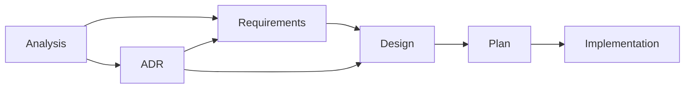

# Kopi Development Templates

This folder provides templates for the Traceable Development Lifecycle (TDL), covering the full development lifecycle from analysis to implementation with complete traceability. All documents must be in English (see `CLAUDE.md` for the documentation language policy and repo-wide guidance).

Note: For repository-specific conventions (commands, workflow, architecture, error handling, naming), consult `CLAUDE.md` as the authoritative reference.

## Traceable Development Lifecycle (TDL)

*Structured phases, linked artifacts, verifiable outcomes*

The TDL progresses through distinct phases, each with specific deliverables:

**Key paths:**
- Analysis discovers both requirements and architectural concerns
- ADRs can generate new requirements (constraints/standards)
- Both requirements and ADRs feed into design decisions
- Design integrates all inputs before proceeding to plan

### Document Organization

<table>
<thead>
<tr>
<th>Phase</th>
<th>Document Type</th>
<th>Template</th>
<th>Created Files Location</th>
<th>Naming Convention</th>
<th>Lifecycle</th>
</tr>
</thead>
<tbody>
<tr>
<td><strong>Discovery</strong></td>
<td>Analysis</td>
<td><code>analysis.md</code></td>
<td><code>docs/analysis/AN-####-&lt;topic&gt;.md</code></td>
<td><code>AN-####-&lt;topic&gt;</code> (e.g., <code>AN-0001-cache-optimization.md</code>)</td>
<td>Temporary, archived after requirements formalized</td>
</tr>
<tr>
<td rowspan="2"><strong>Requirements</strong></td>
<td>Functional Req</td>
<td><code>requirements.md</code></td>
<td><code>docs/requirements/FR-####-&lt;capability&gt;.md</code></td>
<td><code>FR-####-&lt;capability&gt;</code> (e.g., <code>FR-0001-user-authentication.md</code>)</td>
<td>Long-lived, evolve independently</td>
</tr>
<tr>
<td>Non-Functional Req</td>
<td><code>requirements.md</code></td>
<td><code>docs/requirements/NFR-####-&lt;quality&gt;.md</code></td>
<td><code>NFR-####-&lt;quality&gt;</code> (e.g., <code>NFR-0001-performance.md</code>)</td>
<td>Long-lived, evolve independently</td>
</tr>
<tr>
<td><strong>Decisions</strong></td>
<td>ADRs</td>
<td><code>adr.md</code> <code>adr-lite.md</code></td>
<td><code>docs/adr/ADR-####-&lt;title&gt;.md</code></td>
<td><code>ADR-####-&lt;title&gt;</code> (e.g., <code>ADR-0020-cache-storage-format.md</code>)</td>
<td>Long-lived, document decisions</td>
</tr>
<tr>
<td rowspan="3"><strong>Tasks</strong></td>
<td>Task Directory</td>
<td>N/A</td>
<td><code>docs/tasks/T-####-&lt;name&gt;/</code></td>
<td><code>T-####-&lt;name&gt;</code> (e.g., <code>T-0001-cache-refresh/</code>)</td>
<td>Task-scoped container</td>
</tr>
<tr>
<td>Task Design</td>
<td><code>design.md</code></td>
<td><code>docs/tasks/T-####-&lt;name&gt;/design.md</code></td>
<td>Fixed name <code>design.md</code> within task directory</td>
<td>Task-scoped</td>
</tr>
<tr>
<td>Task Plan</td>
<td><code>plan.md</code></td>
<td><code>docs/tasks/T-####-&lt;name&gt;/plan.md</code></td>
<td>Fixed name <code>plan.md</code> within task directory</td>
<td>Task-scoped</td>
</tr>
<tr>
<td><strong>Tracking</strong></td>
<td>Traceability</td>
<td>N/A (not a template)</td>
<td><code>docs/traceability.md</code></td>
<td>Single file (project document)</td>
<td>Long-lived, central N:M mapping</td>
</tr>
</tbody>
</table>

## Development Workflow Steps

### Step 1: Analysis (exploration/discovery)

- **Purpose**: Explore problem space, gather data, understand stakeholder needs
  - Be exploratory - it's OK to have uncertainties
  - Document what you learn as you learn it
  - Focus on understanding the problem before jumping to solutions
  - Keep it lightweight - this is a working document
  - Transition discovered requirements to formal FR/NFR documents when ready
- **Template**: [`analysis.md`](analysis.md) - Template for exploratory analysis and problem space investigation. Used to discover requirements through research and stakeholder analysis
- **Output**: List of discovered requirements (FR-DRAFT, NFR-DRAFT) and architectural concerns
- **Location**: `docs/analysis/AN-####-<topic>.md` (move to `archive/` when complete)
- **Naming**: `AN-####-<topic>` format like `AN-0001-cache-optimization.md`, `AN-0002-javafx-support.md`
- **Transition**: Analysis can lead to:
  - Creating formal requirements from discoveries
  - Identifying architectural decisions that need to be made

### Step 2: Requirements (what/why) 

- **Purpose**: Formalize individual requirements with clear acceptance criteria
- **Template**: [`requirements.md`](requirements.md) - Template for individual requirement documents (FR-####-<capability> or NFR-####-<quality>). Each requirement is a standalone, long-lived document
- **Output**: Formal requirements with IDs (`FR-####-<capability>`, `NFR-####-<quality>`), measurable criteria
- **Location**: `docs/requirements/FR-####-<capability>.md` and `docs/requirements/NFR-####-<quality>.md`
- **Naming**: `FR-####-<capability>` (functional capabilities) and `NFR-####-<quality>` (quality attributes), 4-digit IDs
- **Sources**: Can come from:
  - Analysis documents (discovered requirements)
  - ADR decisions (derived requirements/constraints)
- **Transition**: Requirements feed into design
- **Relationships**: One analysis can discover multiple requirements; requirements can span multiple tasks (N:M)

### Step 3: Architecture Decisions (decisions/trade-offs)

- **Purpose**: Make and document significant architecture/design decisions
- **Templates**: 
  - [`adr.md`](adr.md) - Full ADR template for architecturally significant decisions, broad impact, or important trade-offs
  - [`adr-lite.md`](adr-lite.md) - Lightweight ADR for tactical choices with limited scope and clear best practices
- **Output**: ADR documents with decisions, rationale, and consequences
- **Location**: `docs/adr/ADR-####-<title>.md` (new) or `docs/adr/archive/###-<title>.md` (existing)
- **Naming**: `ADR-####-<descriptive-title>.md` (e.g., `ADR-0020-cache-storage-format.md`)
- **Sources**: Triggered by analysis findings or implementation needs
- **Transition**: ADRs can:
  - Generate new requirements (constraints/standards)
  - Feed directly into design for architectural constraints

### Step 4: Design (how to implement)

- **Purpose**: Technical design for implementing requirements within architecture constraints
- **Template**: [`design.md`](design.md) - Task-specific design document. References requirement IDs and documents how to implement them
- **Output**: Component design, data flows, APIs, error handling strategy
- **Sources**: Integrates inputs from:
  - Requirements (what needs to be built)
  - ADRs (architectural constraints and decisions)
- **References**: FR/NFR IDs and relevant ADRs (don't duplicate requirement text)
- **Location**: `docs/tasks/T-####-<task>/design.md` (task-scoped)
- **Naming**: Task directory + fixed name (e.g., `docs/tasks/T-0001-cache-refresh/design.md`)
- **Transition**: With design complete, create execution plan

### Step 5: Plan & Execution (phases/tasks)

- **Purpose**: Break down implementation into manageable phases with clear verification
- **Template**: [`plan.md`](plan.md) - Task-specific implementation plan. Breaks down work into phases with verification steps
- **Output**: Phased execution plan with tasks, verification steps, and DoD
- **References**: FR/NFR IDs being implemented, link to design.md
- **Verification**: Use commands from `CLAUDE.md`:
  - `cargo check`, `cargo fmt`, `cargo clippy --all-targets -- -D warnings`
  - `cargo test --lib --quiet`, `cargo it`, `cargo perf`, `cargo bench`
- **Location**: `docs/tasks/T-####-<task>/plan.md` (task-scoped)
- **Naming**: Task directory + fixed name (e.g., `docs/tasks/T-0001-cache-refresh/plan.md`)
- **Transition**: Execute the plan, updating status and traceability matrix
- **Phase Independence**: Each phase must be self-contained and executable independently:
  - Context may be reset between phases (`/clear` command)
  - Critical information must be documented in phase deliverables
  - Dependencies between phases must be explicitly stated

## Cross-Reference Requirements

Requirements documents must declare their `FR-####`/`NFR-####` ID in the header. Task `design.md` and `plan.md` must include a Links/Traceability section that lists related requirement IDs using these exact tokens for reliable cross-referencing.

## Common Documentation Requirements

These requirements apply to ALL documentation templates (Requirements, Design, Plan, and ADRs):

- **Language**: All documentation must be written in English (per `CLAUDE.md` policy)
- **Links Section**: Mandatory in every template for traceability. If something doesn't apply, write: `N/A – <reason>`
- **Metadata**: Include Type/Owner/Reviewers/Status/Date Created consistently at the top of every document
- **Traceability**: 
  - Use FR/NFR/ADR IDs throughout documentation
  - Cross-link Requirements → Design → Plan documents
  - Include Requirements Mapping table in Design documents
  - Reference IDs in tests where feasible
- **Cross-linking**: Use relative links between documents
- **Change History**: Use Git history (`git log --follow <file>`). Templates intentionally omit Change Log sections to avoid duplication
- **Verification**: Use canonical cargo commands from `CLAUDE.md` in Verification blocks and Definition of Done
- **Consistency**: Don't duplicate requirements text; Design references requirement IDs; Plan references both
- **IDs & Naming**: Use explicit, stable IDs/names. Avoid vague terms like "manager" or "util" (per `CLAUDE.md`)
- **Date Format**: Use `YYYY-MM-DD` format consistently
- **PR Integration**: Link Requirements/Design/Plan and relevant ADRs in PRs; verify DoD items from `AGENTS.md`
- **Links vs External References**: All templates use a clear distinction between internal and external resources:
  - **Links**: Internal project artifacts only (files in repo, issues, PRs). This section is for traceability within the project
  - **External References**: External resources only (standards, articles, documentation). Never include internal documents here
  - **Simple rule**: "Repository or internal tracker? → Links. Everything else? → External References"

## Traceability

- **Central Matrix**: Maintain `docs/traceability.md` as the authoritative N:M mapping between requirements and tasks, with pointers to related tests and ADRs
- **Analysis → Requirements**: Track which analysis led to which formal requirements
- **Requirements → Tasks**: Map which tasks implement which requirements
- **In-Doc Links**: All documents must maintain Links sections for traceability
- **Tests**: Reference `FR-####`/`NFR-####` in test names or comments when feasible
- **Review Order**: Analysis (exploration) → Requirements (scope) → ADR (decisions) → Design (architecture) → Plan (execution)

## Pull Request Checklist

- Link relevant artifacts in the PR description:
  - Source analysis documents if applicable
  - `FR-####`/`NFR-####` requirements being addressed
  - Affected task folder(s) under `docs/tasks/T-####-<task>`
  - Related ADRs
  - Updated rows in `docs/traceability.md`
- Automated Verification Checklist:
  - [ ] Format verified: `cargo fmt --check`
  - [ ] Linting clean: `cargo clippy --all-targets -- -D warnings`
  - [ ] All test commands pass: `cargo test --lib --quiet`
  - [ ] Requirements traced: All FR/NFR IDs referenced in code comments where applicable
  - [ ] ADR references: Design decisions linked to ADR numbers
- Manual Verification:
  - [ ] Error messages clear and in English (per `CLAUDE.md`)
  - [ ] Documentation updated (`docs/reference.md`, user docs if needed)
  - [ ] Platform behavior validated when relevant
  - [ ] Traceability matrix updated with new/changed links

## Small Changes Variant

- For trivial fixes, you may skip the full workflow if **ALL** these criteria apply:
  - Code changes < 50 lines
  - No new dependencies
  - No API changes  
  - No architectural impact
  - Single file modification
  - Estimated execution time < 30 minutes
- Create minimal `docs/tasks/T-####-<task>/plan.md` with a short Phase and DoD
- Ensure all verification commands pass
- Update `docs/traceability.md` only if requirements ↔ tasks linkage changes

## Archive Policy

- **Analysis documents**: Move to `docs/analysis/archive/` after requirements are formalized
- **Completed tasks**: New tasks remain in place; legacy tasks in `docs/tasks/archive/`
- **Deprecated requirements**: Update status to "Deprecated" but keep in `docs/requirements/`
- **Superseded ADRs**: Update status and link to superseding ADR
- **Legacy ADRs**: Pre-2025 ADRs archived in `docs/adr/archive/`

## Template Usage Instructions

These templates support the Traceable Development Lifecycle (TDL) by providing structured formats for each phase's artifacts.

### Analysis Template (`analysis.md`)
1. Use for exploring problem spaces and discovering requirements
2. Include research, user feedback, technical investigations
3. Document discovered requirements as FR-DRAFT and NFR-DRAFT
4. Archive after requirements are formalized

See Step 1 in Development Workflow Steps for approach and principles.

### Individual Requirement Template (`requirements.md`)
1. One requirement per file for clear ownership and traceability
2. Define measurable acceptance criteria; keep brief and testable
3. Requirements are long-lived and can be referenced by multiple tasks over time
4. Task design/plan documents reference these requirement IDs rather than duplicating content
5. Prefer clarity and safety: English-only messaging, avoid "manager"/"util" naming, do not use `unsafe`

### ADR Templates (`adr.md` and `adr-lite.md`)
1. Use the Quick Selection Checklist below to choose between Full and Lite templates.
2. One decision per ADR; evolve via `Status` and `Supersedes/Superseded by` links
3. Follow the Common Documentation Requirements (see above) for language, links, and traceability.

**Required-if-Applicable Sections** (Full ADR only): The sections marked "(required if applicable)" - Platform Considerations, Security & Privacy, and Monitoring & Logging - must be filled out when relevant to your decision. If not applicable, you may remove these sections entirely.

#### Quick ADR Template Selection Checklist

**Use Full ADR if ANY of these apply:**
- [ ] Affects 3+ modules or components (quantitative threshold)
- [ ] Has security/privacy implications (risk level: Medium/High)
- [ ] Requires platform-specific handling (Unix/Windows differences)
- [ ] Has 3+ viable alternatives with significant trade-offs
- [ ] Establishes patterns used across the codebase
- [ ] Changes public API or CLI interface
- [ ] Impacts error handling or exit codes
- [ ] Requires monitoring/logging considerations
- [ ] Reversibility effort > 8 hours of work

**Use Lite ADR if ALL of these apply:**
- [ ] Affects single module/component
- [ ] Clear best practice exists
- [ ] Low risk (easily reversible, < 8 hours to revert)
- [ ] No significant trade-offs (< 3 alternatives)
- [ ] No platform-specific considerations
- [ ] Internal implementation detail only

#### Detailed ADR Selection Criteria
- Use the Full ADR when decisions are:
  - Architecturally significant
  - Broad in impact across modules/platforms
  - Involve important trade‑offs or multiple viable options
  - Establish long‑lived patterns or policies
- Use the Lite ADR when decisions are:
  - Tactical and localized in scope
  - Low risk and aligned with established conventions
  - Straightforward with a clear best practice

### Design Template (`design.md`)
1. Reference requirement IDs (FR-####/NFR-####) in the Requirements Summary section
2. Link to relevant ADRs and create new ones when this design introduces material decisions
3. Capture concrete acceptance/success metrics to enable verification
4. Call out platform differences explicitly when touching shell, shims, filesystem, or paths
5. Specify testing strategy early, including external API parsing tests if applicable
6. Prefer clarity and safety over micro-optimizations; avoid `unsafe`, avoid vague names like "manager"/"util", and prefer functions for stateless behavior

### Plan Template (`plan.md`)
1. Reference requirement IDs (FR-####/NFR-####) being implemented
2. Adjust the number of phases based on complexity
3. Break down work into specific, testable items
4. Define verification commands and phase acceptance criteria
5. Identify risks early, with mitigation and fallback
6. Keep status updated as work progresses
7. Phase independence: Ensure each phase is self-contained; the `/clear` command may be executed at phase boundaries to reset context
8. Update or add ADRs when design decisions change
9. Error Recovery Patterns:
   - When blocked during implementation:
     a. Document blocker in current phase status
     b. Create new analysis document for the blocker if needed
     c. Generate new requirements if applicable (e.g., NFR for error handling)
     d. Update plan with mitigation steps

## Examples

### Template Examples

#### Core Workflow Templates
- Analysis: [`docs/templates/examples/analysis-example.md`](examples/analysis-example.md) - Problem exploration and requirement discovery
- Individual Requirement: [`docs/templates/examples/requirement-example.md`](examples/requirement-example.md) - Single requirement document (e.g., FR-0001-user-authentication, NFR-0001-performance)
- Design: [`docs/templates/examples/design-example.md`](examples/design-example.md) - Task-specific technical design referencing requirement IDs
- Plan: [`docs/templates/examples/plan-example.md`](examples/plan-example.md) - Task-specific phased implementation with verification steps

#### ADR Templates
- Full ADR: [`docs/templates/examples/adr-full-example.md`](examples/adr-full-example.md) - Demonstrates all sections
- Lite ADR: [`docs/templates/examples/adr-lite-example.md`](examples/adr-lite-example.md) - Lightweight format for simple decisions

### Real Project Examples (Archived)
- Error Handling: [`docs/adr/archive/004-error-handling-strategy.md`](../adr/archive/004-error-handling-strategy.md) - Full ADR with multiple options analyzed
- Logging Strategy: [`docs/adr/archive/009-logging-strategy.md`](../adr/archive/009-logging-strategy.md) - Comprehensive platform considerations
- Configuration: [`docs/adr/archive/014-configuration-and-version-file-formats.md`](../adr/archive/014-configuration-and-version-file-formats.md) - Focused scope with clear trade-offs
